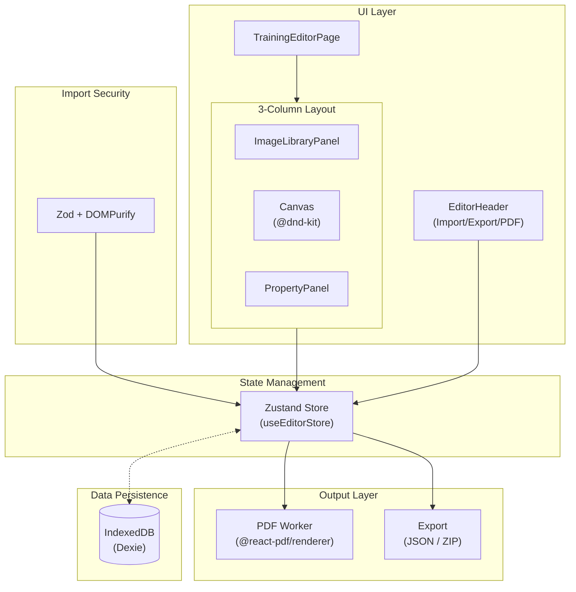

# Rehab-Grid

**[日本語](./README.md) | English**

A support tool for rehabilitation therapists to create self-training instruction sheets.

[](https://www.gnu.org/licenses/agpl-3.0)
[](https://nextjs.org/)
[](https://react.dev/)
[](https://www.typescriptlang.org/)
[](https://v2.tauri.app/)
[](https://turbo.build/)

---

## Overview

"Rehab-Grid" is a tool developed for rehabilitation professionals such as Physical Therapists (PT), Occupational Therapists (OT), and Speech-Language-Hearing Therapists (ST) to create self-training instruction sheets.

### Features

- **Completely Client-Side**: All data processing is done within the browser; no data is sent to external servers
- **No Registration Required**: Start using immediately just by accessing the browser
- **Multi-Platform**: Web version (PWA-enabled) and Desktop version (Windows) available

### Multi-Platform Support

| Platform    | Description                                     | Features                |
| ----------- | ----------------------------------------------- | ----------------------- |
| **Web**     | Direct URL access (instant use via browser)     | PWA-enabled for offline |
| **Desktop** | Installer distribution (for Windows, Tauri 2.x) | Full offline operation  |

### Advantages Over Word/PowerPoint

| Challenge           | Word/PPT                            | Rehab-Grid            |
| ------------------- | ----------------------------------- | --------------------- |
| Layout Adjustment   | Manual positioning of images/text   | Automatic grid layout |
| Template Text Input | Copy-paste or manual input          | One-click insertion   |
| Template Management | Cumbersome file management          | Centralized in-app    |
| Data Security       | Privacy concerns with cloud storage | Fully local operation |

---

## Main Features

### Editor Features

- **Card-Based Editing**: Manage exercise menus as cards, reorder with drag & drop
- **Grid Layout**: Choose from 1/2/3/4 columns. Image placement is automatic
- **Property Editing**: Input structured data: title, description, reps/sets/frequency, precautions
- **Up to 10 Cards**: Optimized for A4 size

### Image Management

- **Sample Image Library**: Preset exercise images for standing, sitting, and lying positions
- **Image Upload**: Upload from local files (JPEG/PNG/GIF/WebP, max 20MB)
- **Clipboard Paste**: Paste images directly with Ctrl+V (Mac: Cmd+V)
- **Image Compression**: Automatic compression on upload for storage efficiency

### Template Feature

- **Preset Templates**: Load frequently used exercise menu sets with one click
- **Edit from Templates**: Fine-tune templates for specific exercise needs

### Output & Save Features

- **PDF Output**: A4 portrait layout with Japanese font (Noto Sans JP) support. Uses Web Worker to avoid blocking the main thread
- **Auto-Save**: Real-time save to IndexedDB (2-second debounce)
- **JSON Export**: Lightweight backup with text data only
- **ZIP Export**: Complete backup including images
- **Import**: Restore projects from JSON/ZIP files (strict validation and sanitization with Zod and DOMPurify)

---

## Tech Stack

### Framework & Build Tools

| Category        | Technology                          | Version |
| --------------- | ----------------------------------- | ------- |
| Framework       | Next.js (App Router, Static Export) | 16.x    |
| UI              | React                               | 19.x    |
| Language        | TypeScript                          | 5.x     |
| Styling         | Tailwind CSS                        | 4.x     |
| Desktop         | Tauri                               | 2.x     |
| Monorepo Build  | Turborepo                           | 2.x     |
| Package Manager | pnpm                                | 10.x    |

### State Management & Data

| Category          | Technology | Purpose                             |
| ----------------- | ---------- | ----------------------------------- |
| State Management  | Zustand    | Global state management             |
| Data Persistence  | Dexie      | IndexedDB wrapper                   |
| Schema Validation | Zod        | Validation for JSON import          |
| Sanitization      | DOMPurify  | XSS protection (input sanitization) |

### UI/UX

| Category      | Technology           | Purpose                        |
| ------------- | -------------------- | ------------------------------ |
| UI Components | shadcn/ui + Radix UI | Accessible headless components |
| Icons         | Lucide React         | Icon library                   |
| D&D           | @dnd-kit             | Drag & drop functionality      |

### Output & File Processing

| Category          | Technology                | Purpose                      |
| ----------------- | ------------------------- | ---------------------------- |
| PDF Generation    | @react-pdf/renderer       | Client-side PDF generation   |
| Image Compression | browser-image-compression | In-browser image compression |
| ZIP Processing    | JSZip                     | Project ZIP export/import    |

### Testing

| Category        | Technology                  | Purpose                     |
| --------------- | --------------------------- | --------------------------- |
| Test Framework  | Vitest                      | Unit & integration tests    |
| DOM Testing     | Testing Library             | Component testing (jsdom)   |
| Browser Testing | Vitest Browser (Playwright) | Component testing (browser) |

### Architecture Overview



---

## Development Environment Setup

### Requirements

- Node.js 18.x or higher
- pnpm 10.x or higher

### Installation

```bash
# Clone the repository
git clone https://github.com/Sierra117-KF/rehab-grid.git
cd rehab-grid

# Install dependencies
pnpm install
```

### Start Development Server

```bash
# All apps development server
pnpm dev

# Web version only
pnpm dev:web

# Desktop version (Tauri)
pnpm dev:desktop
```

Access <http://localhost:3000> in your browser

### Production Build

```bash
# Full build
pnpm build

# Web version only
pnpm build:web

# Desktop version (generates installer)
pnpm build:desktop
```

Static files for the web version are generated in `apps/web/out/`.

---

## Project Structure

This project uses a **Turborepo + pnpm workspace** monorepo structure.

```text
rehab-grid/
├── apps/
│   ├── desktop/                # Desktop version (Tauri 2.x)
│   │   ├── public/             # Static assets (auto-copied)
│   │   ├── scripts/            # Asset copy scripts
│   │   ├── src/app/            # Next.js App Router
│   │   ├── src-tauri/          # Rust backend
│   │   └── [config files]
│   │
│   └── web/                    # Web version (PWA-enabled)
│       ├── public/             # Static assets (auto-copied)
│       ├── scripts/            # Asset copy scripts
│       ├── src/app/            # Next.js App Router
│       ├── tests/              # Integration tests (browser mode)
│       └── [config files]
│
├── packages/
│   ├── assets/                 # Shared static assets
│   │   ├── fonts/              # Japanese fonts (for PDF generation)
│   │   ├── icons/              # Icons
│   │   ├── images/samples/     # Sample images
│   │   └── templates/          # Template definitions
│   │
│   ├── config/                 # Shared config (details: packages/config/README.md)
│   │   ├── eslint/base.mjs     # ESLint shared config
│   │   ├── postcss/            # PostCSS config
│   │   └── typescript/base.json # TypeScript base config
│   │
│   ├── core/                   # Common logic
│   │   ├── src/
│   │   │   ├── index.ts        # Barrel export
│   │   │   ├── hooks/          # Custom hooks
│   │   │   ├── lib/            # DB, Store, Schemas, Constants
│   │   │   ├── types/          # Type definitions
│   │   │   ├── utils/          # Utility functions
│   │   │   └── workers/        # Web Workers
│   │   └── tests/              # Unit tests (jsdom environment)
│   │
│   ├── pages/                  # Shared page components
│   │   ├── src/
│   │   │   ├── index.ts        # Barrel export
│   │   │   ├── changelog/      # Changelog
│   │   │   ├── privacy/        # Privacy Policy
│   │   │   ├── terms/          # Terms of Service
│   │   │   └── training/       # Training instruction sheet editor
│   │   └── [config files]
│   │
│   └── ui/                     # Common UI components
│       ├── src/
│       │   ├── index.ts        # Barrel export
│       │   ├── components/
│       │   │   ├── editor/     # Editor UI
│       │   │   ├── layout/     # Layout UI
│       │   │   ├── pdf/        # PDF related
│       │   │   ├── ui/         # shadcn/ui (do not edit directly)
│       │   │   └── wrapped/    # shadcn/ui wrappers
│       │   └── styles/
│       │       └── globals.css # Common styles
│       └── tests/              # UI component tests (jsdom environment)
│
├── pnpm-workspace.yaml         # pnpm workspace definition
├── turbo.json                  # Turborepo config
├── vitest.config.ts            # Root test config
└── [config files]
```

### Package Dependencies

```
apps/web, apps/desktop
    ↓
@rehab-grid/pages → @rehab-grid/ui → @rehab-grid/core
                                          ↓
                                    Dexie, Zustand, Zod
```

### Design Philosophy

- **`packages/core/src/lib`**: Application-specific core logic (DB, Store, constants, schemas)
- **`packages/core/src/utils`**: Generic helper functions (reusable in other projects)
- **`packages/ui/src/components/ui`**: shadcn/ui components. Do not edit directly as they are overwritten on update
- **`packages/ui/src/components/wrapped`**: shadcn/ui wrappers. Project-specific customizations go here

### Shared Assets Placement and Auto-Copy

- Shared assets placed in `packages/assets/` are automatically copied to each app's `public/` directory during build/dev
- Copied assets in each app are excluded from git management

---

## Development Commands

### Root Commands (via Turborepo)

```bash
# Development server
pnpm dev              # All apps development server
pnpm dev:web          # Web version only
pnpm dev:desktop      # Desktop version (Tauri)

# Production build
pnpm build            # Full build
pnpm build:web        # Web version build
pnpm build:desktop    # Desktop version build (generates installer)

# Lint
pnpm lint             # Full lint
pnpm lint:fix         # Auto-fix

# Type check
pnpm type-check       # Source files
pnpm type-check:test  # Test files
```

### Test Commands

```bash
pnpm test             # All tests (single run)
pnpm test:watch       # Watch mode
pnpm test:ui          # Vitest UI
pnpm test:coverage    # With coverage
pnpm test:jsdom       # jsdom environment only (core, ui)
pnpm test:browser     # Browser environment only (web)
```

### Package-Specific Commands

```bash
pnpm --filter @rehab-grid/web dev
pnpm --filter @rehab-grid/core test
pnpm --filter @rehab-grid/ui lint
```

---

## Adding Templates (For Developers)

### Step 1: Create Exercise Menu in Editor

1. Access the `/training` editor
2. Create exercise menu:
   - Add cards for each exercise item
   - Add images from the image library
   - Input title, description, reps/sets, precautions

### Step 2: Export as ZIP File

1. Click the "Backup" button in the header
2. Select "Complete Backup (ZIP)"
3. `rehab-grid-YYYY-MM-DD.zip` will be downloaded

### Step 3: Extract ZIP and Place Files

```text
packages/assets/templates/{template-id}/
├── project.json          # Required
└── images/               # Only if images exist
    ├── img_001.webp
    └── ...
```

- Directory name should use alphanumeric characters and hyphens only (no Japanese)
- Image filenames must match paths in `project.json`

### Step 4: Add Template Metadata

Add to the `TEMPLATES` array in `packages/core/src/lib/templates/index.ts`:

```typescript
export const TEMPLATES: TemplateMetadata[] = [
  // Existing templates...

  // Add new template
  {
    id: "new-template-id", // Unique ID (same as directory name recommended)
    name: "Template Name", // Display name
    description: "Template description",
    cardCount: 6, // Number of cards
    path: "new-template-id", // Relative path from packages/assets/templates/
  },
];
```

### Step 5: Verify

```bash
pnpm dev:web
```

Check the added template from the template button at `/training`

---

## Regulatory Positioning

This application is a "document creation tool (editor)" that runs in the browser, not a "cloud service (SaaS)" where the developer stores and manages user input data.

Therefore, it does not fall under the "target providers" defined in the "Guidelines for Safety Management by Providers of Information Systems and Services Handling Medical Information" issued by Japan's Ministry of Economy, Trade and Industry (METI) and Ministry of Internal Affairs and Communications (MIC).

When using this application in healthcare facilities, the responsibility for managing created data and outputs (PDF/printed materials) lies entirely with the user (healthcare professional) and their affiliated healthcare facility. Please use it in accordance with your facility's security policies, just as you would when using Microsoft Word or Excel for work.

---

## Security & Privacy

### Fully Local Operation

- All data processing is done within the browser
- No data transmission to external servers
- No analytics tools (Google Analytics, etc.)
- No cookies

### Data Storage

- Saved in browser's **IndexedDB**
- Data persists after browser shutdown
- Data is deleted when browser cache is cleared or incognito mode ends

### Content Security Policy (CSP)

The following CSP is configured to technically block external communication:

```text
default-src 'self';
img-src 'self' blob: data:;
style-src 'self' 'unsafe-inline';
script-src 'self' 'unsafe-inline' 'wasm-unsafe-eval';
font-src 'self';
connect-src 'self';
worker-src 'self' blob:;
frame-src 'self' blob:;
object-src 'none';
base-uri 'self';
```

> **Implementation Location**:
>
> - `apps/web/public/_headers`: HTTP headers for hosting services like Cloudflare Pages (production)
> - `packages/pages/src/training/layout.tsx`: `<meta>` tag fallback
> - **Desktop version additional CSP**: `connect-src 'self' ipc: http://ipc.localhost tauri:;`

**Explanation of each setting:**

- `script-src 'self' 'unsafe-inline' 'wasm-unsafe-eval'`: Required for hydration scripts as Nonce generation is not possible server-side with Next.js static export (`output: 'export'`). `wasm-unsafe-eval` is for WebAssembly used by the PDF generation library (fontkit)
- `worker-src 'self' blob:`: For PDF generation Web Worker
- `frame-src 'self' blob:`: For PDF preview iframe (`blob:` is needed to display PDF Object URLs)
- `object-src 'none'`: Disable plugins like Flash
- `base-uri 'self'`: Prevent injection by restricting base URL

> **Note**: In development (`pnpm dev`), `'unsafe-eval'` is automatically added for HMR (Hot Module Replacement)

### Recommended Usage Environment

For safer use:

- **Guest Mode / Incognito Mode**: Browser extensions are disabled by default
- Use the latest version of your browser

---

## Disclaimer

### Data Storage and Loss

Data created and edited in this application is saved in the browser's IndexedDB. Data may be lost due to the following operations:

- Clearing browser history/cache
- Ending incognito mode (private browsing)
- Browser updates or reinstallation
- Device reset

**Please be sure to export (backup) important data as files.**

### Security Limitations

This application implements basic security measures (fully local operation, CSP settings, etc.), but please note the following:

- Complete security cannot be guaranteed depending on the user's environment (malicious browser extensions, malware infection, etc.)
- Risk of information leakage due to browser or OS vulnerabilities cannot be eliminated
- When using on shared PCs, close the browser after work and clear cache if necessary

> **Note**: Except in cases of intentional misconduct or gross negligence by the provider, the provider assumes no responsibility for damages arising from the above.

### Prohibited Actions

The following actions are prohibited:

1. **Prohibition of Identifiable Images**: Uploading images containing actual patients' or users' face photos, or other information that can easily identify individuals (name tags, distinctive physical features, etc.) to this application
2. **Prohibition of Personal Information Input**: Entering specific patients' names, detailed medical histories, or other sensitive personal information in free input fields (exercise precautions, etc.)

Except in cases of intentional misconduct or gross negligence by the provider, the provider assumes no responsibility for information leakage, privacy violations, or any other damages arising from use that violates the above.

### Medical Accuracy

The medical accuracy of self-training instruction sheets created using this application is not guaranteed. The appropriateness of guidance content should be judged by the rehabilitation professional themselves.

### Service Changes/Termination

The provider may change the content of this service or terminate its provision without prior notice to users. Except in cases of intentional misconduct or gross negligence by the provider, the provider assumes no responsibility for any damages incurred by users as a result.

---

## License

This project is licensed under the [GNU Affero General Public License v3.0 (AGPL-3.0)](https://www.gnu.org/licenses/agpl-3.0).

### Permitted

- Free to use, copy, modify, and redistribute for both commercial and non-commercial purposes
- No restrictions on use in healthcare, nursing care, welfare, or educational institutions

### Obligations

- If you modify the code, you must release the source code under the same AGPL-3.0 license (copyleft)
- If you provide services over a network, you must provide access to the source code
- You must retain copyright and license notices

### About the "Rehab-Grid" Name

The "Rehab-Grid" name and logo are owned by the provider separately from the source code license (AGPL-3.0). If you publish a modified version of this service, please use a different name and logo to avoid confusion with this service.

### License Notice Template for Forks/Modifications

If you fork or modify this project, please use the following templates for license attribution.

#### For README

```
## License

This project is based on [Rehab-Grid](https://github.com/Sierra117-KF/rehab-grid) by Sierra117-KF.

Original work Copyright (C) 2026 Sierra117-KF
Modified by [Your Name/Organization] ([Modification Date: YYYY-MM-DD])

This program is free software: you can redistribute it and/or modify
it under the terms of the GNU Affero General Public License as published
by the Free Software Foundation, either version 3 of the License, or
(at your option) any later version.

Source code: [Your Repository URL]
```

#### For Source Files (Header Comment)

```
/**
 * This file is part of [Your Project Name], based on Rehab-Grid.
 *
 * Original work Copyright (C) 2026 Sierra117-KF
 * Modified by [Your Name] on [YYYY-MM-DD]
 *
 * This program is free software: you can redistribute it and/or modify
 * it under the terms of the GNU Affero General Public License as published
 * by the Free Software Foundation, either version 3 of the License, or
 * (at your option) any later version.
 *
 * Source: https://github.com/[your-username]/[your-repo]
 */
```

Details: https://www.gnu.org/licenses/agpl-3.0

---

## Contributing

Contributions to this project are welcome.

### Issues

Please submit bug reports and feature requests via [Issues](https://github.com/Sierra117-KF/rehab-grid/issues).

When creating an issue, please use one of the following templates:

| Template        | Purpose                                            |
| --------------- | -------------------------------------------------- |
| Bug Report      | Bug reports (environment info, reproduction steps) |
| Feature Request | New feature or improvement requests                |

### Pull Requests

1. Fork this repository
2. Create a feature branch (`git checkout -b feature/amazing-feature`)
3. Commit changes (`git commit -m 'Add amazing feature'`)
4. Push the branch (`git push origin feature/amazing-feature`)
5. Create a Pull Request

When you create a PR, a template will be automatically applied. The template includes the following sections:

- Summary
- Related Issues
- Type of Change (Bug fix / New feature / Refactoring, etc.)
- Testing method
- Checklist (lint / type-check / test confirmation)

### Development Guidelines

- Relaxing ESLint rules is prohibited in principle
- TypeScript type checking (`strictTypeChecked` level)
- Type checking of test files is also required
- Run `pnpm lint && pnpm type-check && pnpm test` before committing

---

## Related Documentation

| Document                                                 | Content                                  |
| -------------------------------------------------------- | ---------------------------------------- |
| [apps/README.md](./apps/README.md)                       | Applications implementation overview     |
| [apps/desktop/README.md](./apps/desktop/README.md)       | Desktop version (Tauri) guide            |
| [apps/web/README.md](./apps/web/README.md)               | Web version (PWA-enabled) guide          |
| [packages/README.md](./packages/README.md)               | Internal packages overview guide         |
| [scripts/README.md](./scripts/README.md)                 | Development & build scripts guide        |
| [docs/testing-guide.md](./docs/testing-guide.md)         | Testing environment guide                |
| [.github/CONTRIBUTING.md](./.github/CONTRIBUTING.md)     | Contribution guide                       |
