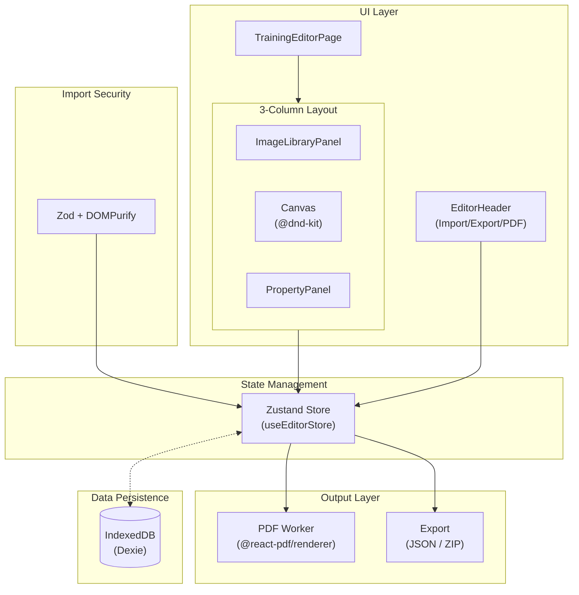

# リハぐり（Rehab-Grid）

**日本語 | [English](./README.en.md)**

リハビリテーションセラピストのための自主トレーニング指導箋作成支援ツール

[](https://www.gnu.org/licenses/agpl-3.0)
[](https://nextjs.org/)
[](https://react.dev/)
[](https://www.typescriptlang.org/)
[](https://v2.tauri.app/)
[](https://turbo.build/)

---

## 概要

「リハぐり」は、理学療法士（PT）、作業療法士（OT）、言語聴覚士（ST）などのリハビリテーション専門職向けに開発された、自主トレーニング指導箋の作成支援ツールです。

### 特徴

- **完全クライアントサイド動作**: すべてのデータ処理はブラウザ内で完結し、外部サーバーへのデータ送信は一切行いません
- **会員登録不要**: ブラウザでアクセスするだけで即座に利用可能
- **マルチプラットフォーム**: Web版（PWA対応）とDesktop版（Windows）を提供

### マルチプラットフォーム対応

| プラットフォーム | 概要                                            | 特徴                  |
| ---------------- | ----------------------------------------------- | --------------------- |
| **Web版**        | URL直接アクセス（ブラウザから即利用）           | PWA対応でオフライン可 |
| **Desktop版**    | インストーラー配布（Windows PC向け、Tauri 2.x） | 完全オフライン動作    |

### Word/PowerPointに対する優位性

| 課題               | Word/PPT                       | リハぐり           |
| ------------------ | ------------------------------ | ------------------ |
| レイアウト調整     | 画像・テキストの位置を手動調整 | 自動グリッド配置   |
| 定型文入力         | コピペまたは手入力             | ワンクリック挿入   |
| テンプレート管理   | ファイル管理が煩雑             | アプリ内で一元管理 |
| データセキュリティ | クラウド保存時に院外送信の懸念 | 完全ローカル動作   |

---

## 主な機能

### エディタ機能

- **カード型編集**: 運動メニューをカード単位で管理し、ドラッグ＆ドロップで順序入れ替え
- **グリッドレイアウト**: 1列/2列/3列/4列から選択可能。画像の配置は自動調整
- **プロパティ編集**: タイトル、説明、回数・セット数・頻度、注意点を構造化データとして入力
- **最大10枚のカード**: A4サイズに最適化された運動メニュー数

### 画像管理

- **サンプル画像ライブラリ**: 立位・座位・臥位の運動画像をプリセット
- **画像アップロード**: ローカルファイルからのアップロード（JPEG/PNG/GIF/WebP対応、最大20MB）
- **クリップボード貼り付け**: Ctrl+V（Mac: Cmd+V）で画像を直接配置
- **画像圧縮**: アップロード時に自動圧縮してストレージ効率を向上

### テンプレート機能

- **プリセットテンプレート**: よく使う運動メニューのセットをワンクリックで読み込み
- **テンプレートからの編集**: テンプレートを土台として、運動内容に合わせた微調整が可能

### 出力・保存機能

- **PDF出力**: A4縦レイアウト、日本語フォント（Noto Sans JP）対応。Web Worker使用でメインスレッドをブロックしない
- **オートセーブ**: IndexedDBへリアルタイム保存（デバウンス2秒）
- **JSONエクスポート**: テキストデータのみの軽量バックアップ
- **ZIPエクスポート**: 画像を含む完全バックアップ
- **インポート**: JSON/ZIPファイルからプロジェクトを復元（ZodとDOMPurifyによる厳格なバリデーション・サニタイズを実施）

---

## 技術スタック

### フレームワーク・ビルドツール

| カテゴリ             | 技術                                    | バージョン |
| -------------------- | --------------------------------------- | ---------- |
| フレームワーク       | Next.js（App Router, 静的エクスポート） | 16.x       |
| UI                   | React                                   | 19.x       |
| 言語                 | TypeScript                              | 5.x        |
| スタイリング         | Tailwind CSS                            | 4.x        |
| デスクトップ         | Tauri                                   | 2.x        |
| モノレポビルド       | Turborepo                               | 2.x        |
| パッケージマネージャ | pnpm                                    | 10.x       |

### 状態管理・データ

| カテゴリ     | 技術      | 用途                              |
| ------------ | --------- | --------------------------------- |
| 状態管理     | Zustand   | グローバル状態管理                |
| データ永続化 | Dexie     | IndexedDBラッパー                 |
| スキーマ検証 | Zod       | JSONインポート時のバリデーション  |
| サニタイズ   | DOMPurify | XSS対策（インポートデータの浄化） |

### UI・UX

| カテゴリ         | 技術                 | 用途                                   |
| ---------------- | -------------------- | -------------------------------------- |
| UIコンポーネント | shadcn/ui + Radix UI | アクセシブルなヘッドレスコンポーネント |
| アイコン         | Lucide React         | アイコンライブラリ                     |
| D&D              | @dnd-kit             | ドラッグ＆ドロップ機能                 |

### 出力・ファイル処理

| カテゴリ | 技術                      | 用途                                     |
| -------- | ------------------------- | ---------------------------------------- |
| PDF生成  | @react-pdf/renderer       | クライアントサイドPDF生成                |
| 画像圧縮 | browser-image-compression | ブラウザ内画像圧縮                       |
| ZIP処理  | JSZip                     | プロジェクトのZIPエクスポート/インポート |

### テスト

| カテゴリ             | 技術                        | 用途                                 |
| -------------------- | --------------------------- | ------------------------------------ |
| テストフレームワーク | Vitest                      | ユニットテスト・統合テスト           |
| DOM テスト           | Testing Library             | コンポーネントテスト（jsdom環境）    |
| ブラウザテスト       | Vitest Browser (Playwright) | コンポーネントテスト（ブラウザ環境） |

### アーキテクチャ概要



---

## 開発環境のセットアップ

### 必要な環境

- Node.js 18.x以上
- pnpm 10.x以上

### インストール

```bash
# リポジトリをクローン
git clone https://github.com/Sierra117-KF/rehab-grid.git
cd rehab-grid

# 依存関係をインストール
pnpm install
```

### 開発サーバー起動

```bash
# 全アプリ開発サーバー
pnpm dev

# Web版のみ
pnpm dev:web

# Desktop版（Tauri）
pnpm dev:desktop
```

ブラウザで http://localhost:3000 にアクセス

### プロダクションビルド

```bash
# 全体ビルド
pnpm build

# Web版のみ
pnpm build:web

# Desktop版（インストーラー生成）
pnpm build:desktop
```

Web版は `apps/web/out/` に静的ファイルが生成されます。

---

## プロジェクト構成

本プロジェクトは **Turborepo + pnpm workspace** によるモノレポ構成です。

```text
rehab-grid/
├── apps/
│   ├── desktop/                # Desktop版（Tauri 2.x）
│   │   ├── public/             # 静的アセット（自動コピー）
│   │   ├── scripts/            # アセットコピースクリプト
│   │   ├── src/app/            # Next.js App Router
│   │   ├── src-tauri/          # Rust バックエンド
│   │   └── [設定ファイル群]
│   │
│   └── web/                    # Web版（PWA対応）
│       ├── public/             # 静的アセット（自動コピー）
│       ├── scripts/            # アセットコピースクリプト
│       ├── src/app/            # Next.js App Router
│       ├── tests/              # 統合テスト（browser mode）
│       └── [設定ファイル群]
│
├── packages/
│   ├── assets/                 # 共有静的アセット
│   │   ├── fonts/              # 日本語フォント（PDF生成用）
│   │   ├── icons/              # アイコン
│   │   ├── images/samples/     # サンプル画像
│   │   └── templates/          # テンプレート定義
│   │
│   ├── config/                 # 共有設定（詳細: packages/config/README.md）
│   │   ├── eslint/base.mjs     # ESLint共有設定
│   │   ├── postcss/            # PostCSS設定
│   │   └── typescript/base.json # TypeScript基本設定
│   │
│   ├── core/                   # 共通ロジック
│   │   ├── src/
│   │   │   ├── index.ts        # バレルエクスポート
│   │   │   ├── hooks/          # カスタムフック
│   │   │   ├── lib/            # DB, Store, Schemas, Constants
│   │   │   ├── types/          # 型定義
│   │   │   ├── utils/          # ユーティリティ関数
│   │   │   └── workers/        # Web Worker
│   │   └── tests/              # ユニットテスト（jsdom環境）
│   │
│   ├── pages/                  # 共有ページコンポーネント
│   │   ├── src/
│   │   │   ├── index.ts        # バレルエクスポート
│   │   │   ├── changelog/      # 更新履歴
│   │   │   ├── privacy/        # プライバシーポリシー
│   │   │   ├── terms/          # 利用規約
│   │   │   └── training/       # 自主トレーニング指導箋エディタ
│   │   └── [設定ファイル群]
│   │
│   └── ui/                     # 共通UIコンポーネント
│       ├── src/
│       │   ├── index.ts        # バレルエクスポート
│       │   ├── components/
│       │   │   ├── editor/     # エディタUI
│       │   │   ├── layout/     # レイアウトUI
│       │   │   ├── pdf/        # PDF関連
│       │   │   ├── ui/         # shadcn/ui（直接編集禁止）
│       │   │   └── wrapped/    # shadcn/uiラッパー
│       │   └── styles/
│       │       └── globals.css # 共通スタイル
│       └── tests/              # UIコンポーネントテスト（jsdom環境）
│
├── pnpm-workspace.yaml         # pnpm ワークスペース定義
├── turbo.json                  # Turborepo設定
├── vitest.config.ts            # ルートテスト設定
└── [設定ファイル群]
```

### パッケージ依存関係

```
apps/web, apps/desktop
    ↓
@rehab-grid/pages → @rehab-grid/ui → @rehab-grid/core
                                          ↓
                                    Dexie, Zustand, Zod
```

### 設計方針

- **`packages/core/src/lib`**: アプリケーション固有のコアロジック（DB、Store、定数、スキーマ）
- **`packages/core/src/utils`**: 汎用的なヘルパー関数（他プロジェクトでも再利用可能）
- **`packages/ui/src/components/ui`**: shadcn/uiコンポーネント。アップデート時に上書きされるため直接編集禁止
- **`packages/ui/src/components/wrapped`**: shadcn/uiのラッパー。プロジェクト固有のカスタマイズはここで行う

### 共通アセットの配置と自動コピー

- `packages/assets/` に配置した共通アセットは、ビルド/dev時に各アプリの `public/` ディレクトリへ自動コピーされる
- 各アプリ内にコピーされたアセットはgit管理から除外される

---

## 開発コマンド

### ルートコマンド（Turborepo経由）

```bash
# 開発サーバー
pnpm dev              # 全アプリ開発サーバー
pnpm dev:web          # Web版のみ
pnpm dev:desktop      # Desktop版（Tauri）

# プロダクションビルド
pnpm build            # 全体ビルド
pnpm build:web        # Web版ビルド
pnpm build:desktop    # Desktop版ビルド（インストーラー生成）

# リント
pnpm lint             # 全体リント
pnpm lint:fix         # 自動修正付き

# 型チェック
pnpm type-check       # ソースファイル
pnpm type-check:test  # テストファイル
```

### テストコマンド

```bash
pnpm test             # 全テスト（単発実行）
pnpm test:watch       # ウォッチモード
pnpm test:ui          # Vitest UI
pnpm test:coverage    # カバレッジ付き
pnpm test:jsdom       # jsdom環境のみ（core, ui）
pnpm test:browser     # ブラウザ環境のみ（web）
```

### パッケージ別コマンド

```bash
pnpm --filter @rehab-grid/web dev
pnpm --filter @rehab-grid/core test
pnpm --filter @rehab-grid/ui lint
```

---

## テンプレート追加手順（開発者向け）

### Step 1: エディタで運動メニューを作成

1. `/training` エディタにアクセス
2. 運動メニューを作成:
   - カードを追加して各運動項目を入力
   - 画像ライブラリから画像を追加
   - タイトル、説明、負荷・回数、注意点を入力

### Step 2: ZIPファイルとしてエクスポート

1. ヘッダーの「バックアップ」ボタンをクリック
2. 「完全バックアップ（ZIP）」を選択
3. `rehab-grid-YYYY-MM-DD.zip` がダウンロードされる

### Step 3: ZIPを解凍してファイルを配置

```text
packages/assets/templates/{template-id}/
├── project.json          # 必須
└── images/               # 画像がある場合のみ
    ├── img_001.webp
    └── ...
```

- ディレクトリ名は英数字とハイフンのみ使用（日本語不可）
- 画像ファイル名は `project.json` 内のパスと一致させる

### Step 4: テンプレートメタデータを追加

`packages/core/src/lib/templates/index.ts` の `TEMPLATES` 配列に追加:

```typescript
export const TEMPLATES: TemplateMetadata[] = [
  // 既存のテンプレート...

  // 新しいテンプレートを追加
  {
    id: "new-template-id", // 一意のID（ディレクトリ名と一致推奨）
    name: "テンプレート名", // 表示名（日本語可）
    description: "テンプレートの説明文",
    cardCount: 6, // カード枚数
    path: "new-template-id", // packages/assets/templates/ からの相対パス
  },
];
```

### Step 5: 動作確認

```bash
pnpm dev:web
```

`/training` でテンプレートボタンから追加したテンプレートを確認

---

## ガイドライン上の位置づけ

本アプリは、ブラウザ上で動作する「資料作成ツール（エディタ）」であり、開発者がユーザーの入力データを預かり管理する「クラウドサービス（SaaS）」ではありません。

したがって、経済産業省・総務省「医療情報を取り扱う情報システム・サービスの提供事業者における安全管理ガイドライン」における「対象事業者」には該当しません。

医療機関において本アプリを使用する場合、作成されたデータおよび出力物（PDF/紙）の管理責任は、全て利用者（医療従事者）および所属する医療機関に帰属します。Microsoft WordやExcel等を業務利用する場合と同様に、各医療機関のセキュリティポリシーに基づいてご利用ください。

---

## セキュリティとプライバシー

### 完全ローカル動作

- すべてのデータ処理はブラウザ内で完結
- 外部サーバーへのデータ送信は一切なし
- アクセス解析ツール（Google Analytics等）不使用
- Cookie不使用

### データ保存

- ブラウザの **IndexedDB** に保存
- ブラウザ終了後もデータは保持
- ブラウザのキャッシュ削除やシークレットモード終了でデータは削除される

### Content Security Policy (CSP)

外部通信を技術的にブロックするため、以下の CSP を設定しています：

```text
default-src 'self';
img-src 'self' blob: data:;
style-src 'self' 'unsafe-inline';
script-src 'self' 'unsafe-inline' 'wasm-unsafe-eval';
font-src 'self';
connect-src 'self';
worker-src 'self' blob:;
frame-src 'self' blob:;
object-src 'none';
base-uri 'self';
```

> **実装場所**:
>
> - `apps/web/public/_headers`: Cloudflare Pages 等のホスティングサービス用 HTTP ヘッダー（本番環境）
> - `packages/pages/src/training/layout.tsx`: `<meta>` タグによるフォールバック
> - **Desktop版追加CSP**: `connect-src 'self' ipc: http://ipc.localhost tauri:;`

**各設定の説明:**

- `script-src 'self' 'unsafe-inline' 'wasm-unsafe-eval'`: Next.js の静的エクスポート（`output: 'export'`）ではサーバーサイドで Nonce 生成が不可能なため、ハイドレーションスクリプト実行に必要。`wasm-unsafe-eval` は PDF 生成ライブラリ（fontkit）が使用する WebAssembly 用
- `worker-src 'self' blob:`: PDF 生成 Web Worker 用
- `frame-src 'self' blob:`: PDF プレビュー用の iframe で使用（`blob:` は PDF の Object URL を表示するために必要）
- `object-src 'none'`: Flash 等のプラグイン無効化
- `base-uri 'self'`: ベース URL 制限によるインジェクション防止

> **Note**: 開発環境（`pnpm dev`）では、HMR（Hot Module Replacement）のために `'unsafe-eval'` が自動的に追加されます

### 推奨利用環境

より安全に利用するため:

- **ゲストモード / シークレットモード**: ブラウザ拡張機能がデフォルトで無効
- 最新バージョンのブラウザを使用

---

## 免責事項（Disclaimer）

### データの保存と消失

本アプリケーションで作成・編集したデータは、ブラウザの IndexedDB に保存されます。以下の操作によりデータが消失する可能性があります:

- ブラウザの履歴・キャッシュの削除
- シークレットモード（プライベートブラウズ）の終了
- ブラウザのアップデートや再インストール
- 端末の初期化

**重要なデータは必ずファイルとしてエクスポート（バックアップ）してください。**

### セキュリティの限界

本アプリケーションは最低限のセキュリティ対策（完全ローカル動作、CSP設定等）を実装していますが、以下の点についてご了承ください:

- ユーザーの使用環境（悪意のあるブラウザ拡張機能、マルウェア感染等）によっては、完全な安全性を保障することはできません
- ブラウザやOSの脆弱性による情報漏洩のリスクは排除できません
- 共有PC等での使用時は、作業終了後にブラウザを閉じ、必要に応じてキャッシュを削除してください

> **注意**: 提供者の故意または重大な過失がある場合を除き、上記により生じた損害について提供者は責任を負いません。

### 禁止事項

以下の行為は禁止されています：

1. **個人特定画像の使用禁止**: 実際の患者・利用者の顔写真、その他個人を容易に特定できる情報（名札、特徴的な身体的特徴等）を含む画像を本アプリにアップロードする行為
2. **個人情報の入力禁止**: 自由入力欄（運動の注意点等）に、特定の患者の氏名、詳細な病歴、その他要配慮個人情報を入力する行為

上記に違反した利用により発生した情報漏洩、プライバシー侵害、その他一切の損害について、提供者の故意または重大な過失がある場合を除き、提供者は責任を負いません。

### 医学的正確性

本アプリケーションを使用して作成された自主トレーニング指導箋の医学的正確性については保証しません。指導内容の適切性は、使用するリハビリテーション専門職自身が判断してください。

### サービスの変更・終了

提供者は、利用者への事前通知なく、本サービスの内容を変更、または提供を終了することがあります。これにより利用者に生じた損害について、提供者の故意または重大な過失がある場合を除き、提供者は責任を負いません。

---

## License

このプロジェクトは [GNU Affero General Public License v3.0 (AGPL-3.0)](https://www.gnu.org/licenses/agpl-3.0) の下でライセンスされています。

### 許可されること

- 商用・非商用を問わず自由に使用、複製、改変、再配布が可能
- 医療・介護・福祉・教育機関等での業務利用も制限なし

### 義務

- 改変した場合、同じAGPL-3.0ライセンスでソースコードを公開する必要があります（コピーレフト）
- ネットワーク経由でサービスを提供する場合も、ソースコードへのアクセス手段を提供する必要があります
- 著作権表示とライセンス表示を保持する必要があります

### 「リハぐり」の名称について

「リハぐり」の名称およびロゴは、ソースコードのライセンス（AGPL-3.0）とは別に、提供者が権利を保有しています。改変したサービスを公開する場合は、本サービスとの混同を避けるため、別の名称・ロゴを使用してください。

### フォーク・改変時のライセンス表示テンプレート

本プロジェクトをフォーク・改変して利用する場合、以下のテンプレートを使用してライセンス表示を行ってください。

#### README用テンプレート

```
## License

This project is based on [Rehab-Grid](https://github.com/Sierra117-KF/rehab-grid) by Sierra117-KF.

Original work Copyright (C) 2026 Sierra117-KF
Modified by [あなたの名前/組織名] ([改変日: YYYY-MM-DD])

This program is free software: you can redistribute it and/or modify
it under the terms of the GNU Affero General Public License as published
by the Free Software Foundation, either version 3 of the License, or
(at your option) any later version.

Source code: [あなたのリポジトリURL]
```

#### ソースファイル用テンプレート（各ファイルのヘッダーに記載）

```
/**
 * This file is part of [Your Project Name], based on Rehab-Grid.
 *
 * Original work Copyright (C) 2026 Sierra117-KF
 * Modified by [Your Name] on [YYYY-MM-DD]
 *
 * This program is free software: you can redistribute it and/or modify
 * it under the terms of the GNU Affero General Public License as published
 * by the Free Software Foundation, either version 3 of the License, or
 * (at your option) any later version.
 *
 * Source: https://github.com/[your-username]/[your-repo]
 */
```

詳細: https://www.gnu.org/licenses/agpl-3.0

---

## 貢献（Contributing）

本プロジェクトへの貢献を歓迎します。

### Issue

バグ報告や機能リクエストは [Issues](https://github.com/Sierra117-KF/rehab-grid/issues) にてお願いします。

Issueを作成する際は、以下のテンプレートをご利用ください：

| テンプレート | 用途                                     |
| ------------ | ---------------------------------------- |
| バグ報告     | 不具合の報告（環境情報・再現手順を含む） |
| 機能要望     | 新機能や改善のリクエスト                 |

### Pull Request

1. このリポジトリをフォーク
2. 機能ブランチを作成 (`git checkout -b feature/amazing-feature`)
3. 変更をコミット (`git commit -m 'Add amazing feature'`)
4. ブランチをプッシュ (`git push origin feature/amazing-feature`)
5. Pull Request を作成

PRを作成すると、自動的にテンプレートが適用されます。テンプレートには以下の項目が含まれています：

- 概要 / Summary
- 関連Issue
- 変更の種類（バグ修正 / 新機能 / リファクタリング等）
- テスト方法
- チェックリスト（lint / type-check / test の確認）

### 開発ガイドライン

- ESLintルールの緩和は原則禁止
- TypeScriptの型チェック（`strictTypeChecked`水準）
- テストファイルの型チェックも必須
- コミット前に `pnpm lint && pnpm type-check && pnpm test` を実行

---

## 関連ドキュメント

| ドキュメント                                             | 内容                                 |
| -------------------------------------------------------- | ------------------------------------ |
| [apps/README.md](./apps/README.md)                       | アプリケーション実装の概要ガイド     |
| [apps/desktop/README.md](./apps/desktop/README.md)       | Desktop版（Tauri）のガイド           |
| [apps/web/README.md](./apps/web/README.md)               | Web版（PWA対応）のガイド             |
| [packages/README.md](./packages/README.md)               | 内部パッケージ全体のガイド           |
| [scripts/README.md](./scripts/README.md)                 | 開発・ビルド用スクリプトのガイド     |
| [docs/testing-guide.md](./docs/testing-guide.md)         | テスト環境のガイド                   |
| [.github/CONTRIBUTING.md](./.github/CONTRIBUTING.md)     | コントリビューションガイド           |
